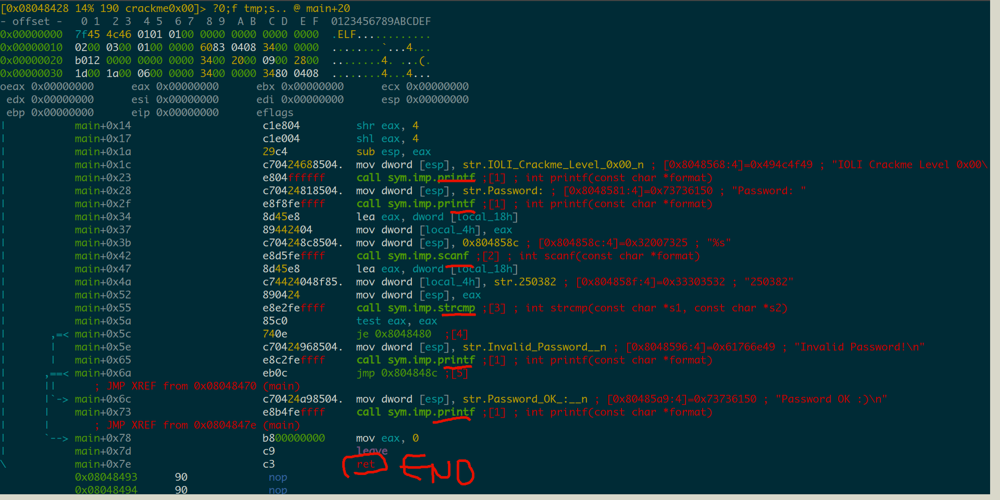
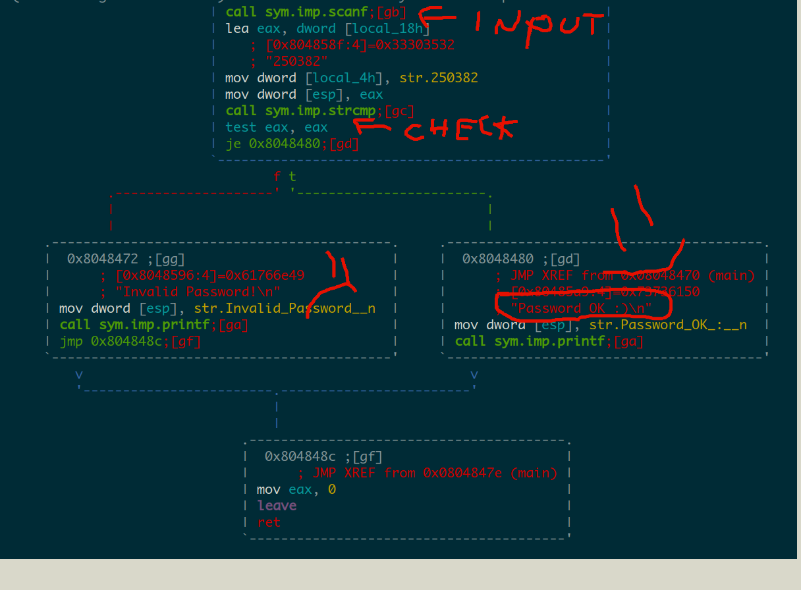
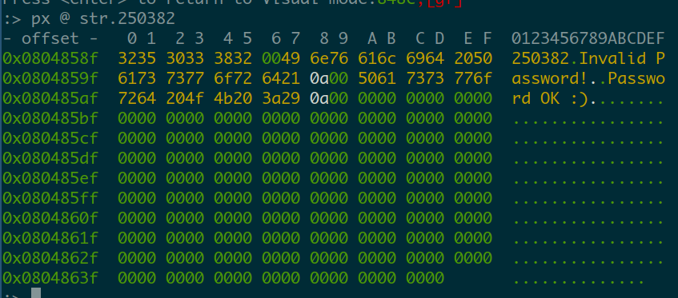
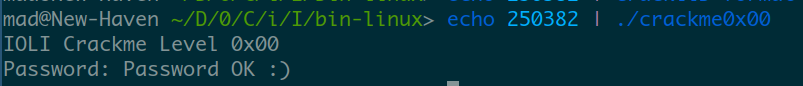
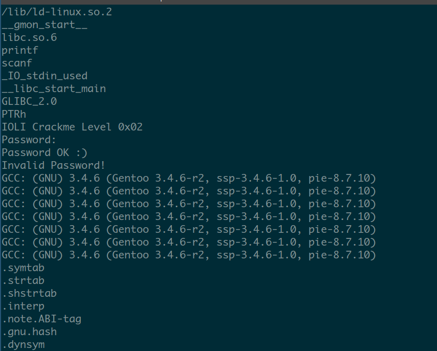
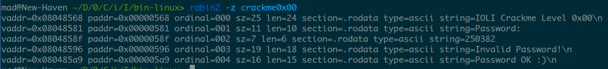

# Crackme0x00
first we check the executable
```
$ file ./crackme0x00
crackme0x00: ELF 32-bit LSB executable, Intel 80386, version 1 (SYSV), dynamically linked, interpreter /lib/ld-linux.so.2, for GNU/Linux 2.6.9, not stripped
```
it's a linux elf, 32 bits.
Let's just run it for a sec, just to get a feel for these crackmes
```
$ ./crackme0x00
IOLI Crackme Level 0x00
Password: hello
Invalid Password!
```
Ok, time to use **radare2**. We open it with `r2 crackme0x00`, load radare analysis and renaming of functions with the `aaa` command, load relative offsets (so we get something like main+1 instead of 0x00348923) with `e asm.reloff=true` and get directly into visual mode with the `V` command. Next we proceed to the desired disassembly mode with `p` and then with `_` we can search for the _main_ function.
We can then concentrate on the main procedure calls to get a feel:



The program is simply printing some text for the introduction (*printf*), asking for some input (*scanf*), comparing 2 strings (*strcmp*) and printing the final stuff. These are all C library functions and in case you don't know any of them you may open up a shell and type, for example, `man 3 strcmp` for an extensive description.

It is pretty clear this program is doing all the magic inside *strcmp* and afterwards there is a **jump** asm instruction which will check some condition and then choose to do one thing or another.
A password check, most probably ;).
Let us switch to graph if-then-else mode (or whatever it's called) by hitting `space`



If you've read the *strcmp* man page you will notice it returns 0 when two strings are the same. In fact, two strings are loaded on the stack: one gets loaded to the _eax_ register and then directly onto the stack (_esp_ on the stack). The other string gets loaded to *[local_4h]* which basically means _esp+0x4_ if you go check the radare variable definitions at the top of the functions. So that is the second parameter of the `strcmp` function.
If we go check the previous `scanf` call, we will see that an address from *[local_18h]* gets loaded as the second paramter to the function, which is where we actually need to store the input. So this is actually what we give to the crackme as input.
We're left with the other paramter: `mov dword [local_4h], str.250382`
With `:` we can briefly get to command mode (we were in viewing mode) and check the value for that string:

It's a \n+null (0x320x00) terminated string that says "250382".
Let's try it.

Yay.

## patching
We can just jump directly to the successful code block with an unconditional _jmp_.
Do `:oo+` to reopen the file with writing enabled. Make sure to make a backup.
Hit `c` to go into cursor mode, hit tab to get to the right window if you are in one of those modes, and then navigate to the instruction you want to modify (that je we saw earlier). Hit `a` and insert "jmp 0x08048480" to have the binary directly jump to the success code. done.

## pro-tip
it is possible to check strings stored into the program's static data (which means it's not really obfuscated) using the `strings` program or radare's binary info tool `rabin2`.


The `strings` program tries its best to return every possible string, radare actually unpacks the executable and looks into the important parts. 90% of the time `rabin2` will do the job.
